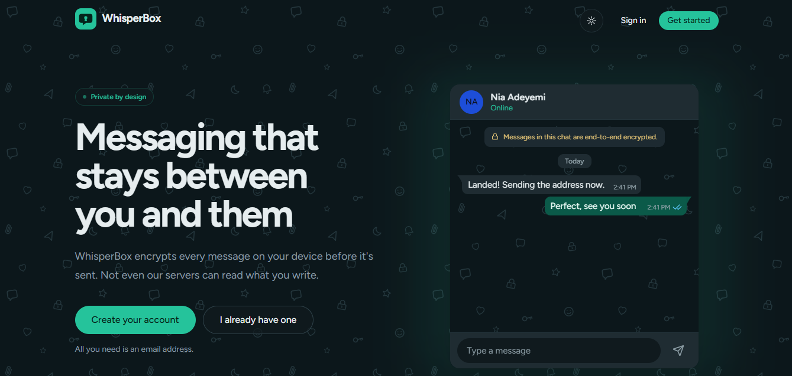
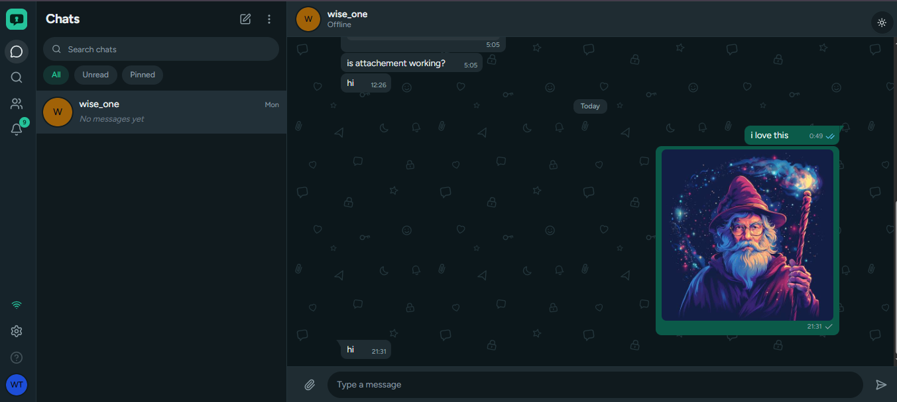

<p align="center">
  
</p>

<p align="center">
  <strong>Messaging that stays between you and them.</strong><br>
  End-to-end encrypted chat. Messages are encrypted on your device — the server only ever sees ciphertext.
</p>

<p align="center">
  
  
  
  
</p>

<p align="center">
  <a href="#features">Features</a> ·
  <a href="#tech-stack">Tech Stack</a> ·
  <a href="#getting-started">Getting Started</a> ·
  <a href="#project-structure">Project Structure</a> ·
  <a href="#security-model">Security Model</a> ·
  <a href="#roadmap">Roadmap</a>
</p>

---

## Overview

WhisperBox is a real-time messaging app built around a simple rule: **nothing readable ever leaves your device.** Every message and attachment is encrypted client-side before it's sent, and decrypted client-side when it's read. Your encryption identity lives behind a passphrase set per device — not your account password — so unlocking your inbox on a new device is a deliberate, explicit step.

## Features

**Security**

- Client-side end-to-end encryption for messages and file attachments (up to 500MB)
- Per-device encryption identity, unlocked with a local passphrase never sent to the server
- Device reset flow if a passphrase is forgotten (old messages on that device become unreadable — no server-side recovery)

**Messaging**

- Direct messages and group conversations
- Delivery and read receipts, typing indicators, online presence
- Pinned chats, unread filters, and full-text search across conversations and contacts
- Offline queueing — compose without a connection, sends automatically on reconnect

**Experience**

- Responsive, WhatsApp-inspired UI: an icon rail + chat list + conversation view on desktop, a single-screen navigation model on mobile
- Light and dark themes
- Notifications center for account and conversation activity

## Tech Stack

| Layer                  | Choice                         |
| ---------------------- | ------------------------------ |
| Framework              | Next.js (App Router)           |
| Language               | TypeScript                     |
| Styling                | Tailwind CSS v4                |
| UI primitives          | Radix UI, `lucide-react`       |
| Forms & validation     | React Hook Form + Zod          |
| Client state           | Zustand                        |
| Server state / caching | TanStack Query                 |
| Auth                   | Better Auth (email + password) |
| Realtime               | Socket.IO client               |
| Motion                 | Framer Motion                  |

## Getting Started

### Prerequisites

- Node.js 20+
- A running instance of the API this client talks to (see that service's own README for setup)

### Install

```bash
git clone https://github.com/UkannaRaymond/whisperbox.git
cd whisperbox
npm install
```

### Configure

Create a `.env.local` in the project root:

```bash
# Base URL of the WhisperBox API
NEXT_PUBLIC_API_URL=http://localhost:4000

# Better Auth
BETTER_AUTH_SECRET=replace-with-a-generated-secret
BETTER_AUTH_URL=http://localhost:3000
```

> Adjust these to match whatever your API and auth setup actually expect — fill in any additional variables your backend requires.

### Run

```bash
npm run dev
```

The app runs at `http://localhost:3000`.

## Project Structure

```
app/
  (auth)/            Sign in, sign up
  (app)/             Authenticated shell: conversations, contacts, notifications, search, settings
  onboarding/         Post-signup username step
components/
  ui/                Shared primitives (button, input, dialog, ...)
  shared/            Logo and other cross-page pieces
features/
  auth/              Auth forms, device-identity unlock gate
  chat/              Sidebar, conversation view, composer, hooks
  offline/           Network status and the offline send queue
  notifications/      Notification center
lib/                 API client, auth client, utilities
```

## Screenshots

<p align="center">
  <br><br>
  
</p>

> Add your own screenshots under `docs/screenshots/` — the paths above are placeholders.

## Security Model

- On first use, each device generates its own key pair. The private key is encrypted at rest with a passphrase you choose and never leaves the device unencrypted.
- Messages are encrypted with a per-message key, which is itself encrypted separately for each recipient's device — the server relays ciphertext and wrapped keys, but never has access to a private key or plaintext.
- If you use the "forgot passphrase" option on a device, you'll regain access, but any messages already encrypted to that device's old key won't be readable again — this is an inherent trade-off of true end-to-end encryption, not a bug.

This is an overview, not a full threat model — see `/docs` for the detailed spec if one exists in this repo.

## Roadmap

- [ ] Multi-device key sync
- [ ] Voice and video calls
- [ ] Message reactions and threads
- [ ] Sender attribution in group chat previews

## Contributing

Issues and pull requests are welcome. Please open an issue to discuss significant changes before submitting a PR.

## License

This project is licensed under the MIT License. See [`LICENSE`](./LICENSE) for details.

---

<p align="center"><sub>Built with care for private conversations.</sub></p>
